```markdown
# 🎤 EchoClone - Voice Assistant on Raspberry Pi

[](https://www.raspberrypi.org/)
[](https://developer.amazon.com/alexa/avs-device-sdk)

A DIY Amazon Alexa clone implemented on Raspberry Pi hardware with full voice control capabilities. Perfect for IoT projects and smart home enthusiasts!

---

## ✨ Key Features
| Feature | Description |
|---------|-------------|
| 🎤 **Voice Recognition** | Wake-word detection ("Alexa") with far-field audio processing |
| ☁️ **Cloud Integration** | Real-time processing via Amazon Alexa Voice Service |
| 🌐 **Multi-Lingual** | Supports English & Hindi with dialect recognition |
| 📻 **Media Playback** | Music streaming, podcast playback, and audio books |
| 🏠 **Smart Home Control** | IoT device integration framework |

---

## 🛠 Hardware Setup

```mermaid
graph LR
    R[Raspberry Pi 3B+] --> M[🎤 USB Microphone]
    R --> S[🔈 3.5mm Speakers]
    R --> SD[💾 32GB MicroSD]
    R --> SC[🎛️ USB Soundcard]
    R --> I[🌐 Internet Connection]
```


---

## ⚡ Quick Start
1. **Flash Raspberry Pi OS**
   ```bash
   sudo apt update && sudo apt full-upgrade
   ```
2. **Install Dependencies**
   ```bash
   sudo apt install libcurl4-openssl-dev libssl-dev cmake
   ```
3. **Configure AVS SDK**
   ```bash
   cd EchoClone && sudo bash setup.sh config.json
   ```

---

## 📂 Demo & Documentation
[](https://drive.google.com/folderview?id=1mlPUXy1ZFxhZhvBVh_5_mGjLH0eNrOnx)

---

## 🧩 Technology Stack
```python
Core = {
    "Voice_Service": "Alexa Voice Service (AVS) SDK",
    "Language": "C++11",
    "OS": "Raspbian Buster"
}

Libraries = [
    "libcurl >=7.67.0",
    "OpenSSL >=1.1.1",
    "nghttp2 >=1.39.2",
    "CMake >=3.1"
]

Hardware = [
    "Raspberry Pi 3B+",
    "USB Soundcard",
    "3.5mm Microphone",
    "Stereo Speakers"
]

> **Built with ❤️ by Shivani**  
